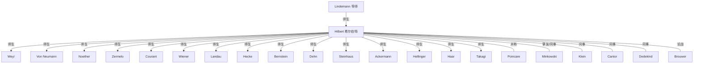
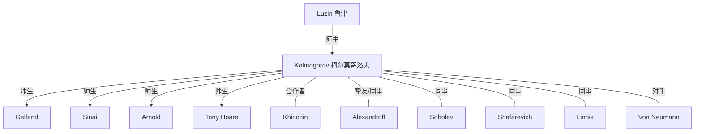

# 数学家社会关系网络分析报告

> 数据源：`greatminds` MySQL 数据库（`127.0.0.1:3306`，本机无密码 root）
> 分析对象：社会关系（裙带关系）网络 + 国籍维度

---

## 一、数据库概览

当前 `greatminds` 库核心表规模：

| 表 | 行数 | 说明 |
|---|---|---|
| `people` | 1111 | 人物主表 |
| `person_relation` | 1183 | 人物关系边（有向/无向） |
| `relation_types` | 9 | 关系类型字典 |
| `person_nationality` | 200 | 人物 ↔ 国籍（多对多） |
| `countries` | 49 | 国家/政权字典（含历史政权） |
| `person_field` | 614 | 人物 ↔ 研究领域 |
| `fields` | 211 | 研究领域字典 |
| `award_laureate` | 953 | 人物 ↔ 奖项 |

> `people` 达 1111 人、关系边达 1183 条，除数学家外还混入物理学家、化学家、
> 计算机科学家等（职业字典含 13 类），本报告聚焦**数学家**及其关系。

---

## 二、可输出的关系类型（9 种）

关系由 relation_types 字典定义，directed=1 表示有向（如师生：导师→学生），
directed=0 表示无向（如同事、合作者）。

| 关系键 | 中文名 | 方向 | 边数 | 含义 |
|---|---|:---:|---:|---|
| advisor-student | 师生 | 有向 | 696 | 博士导师 / 学术引路人 → 学生 |
| colleague | 同事 | 无向 | 292 | 同一机构 / 学派 / 时代的同行 |
| collaborator | 合作者 | 无向 | 97 | 共同署名 / 联合研究 |
| parent-child | 父子/直系亲属 | 有向 | 28 | 血缘直系亲属 |
| spouse | 夫妻 | 无向 | 27 | 配偶 |
| co-honored | 荣誉共同体/并称 | 无向 | 24 | 同获荣誉、历史并称 |
| controversy | 争议 | 无向 | 14 | 学术 / 优先权 / 历史争议 |
| rival | 对手/仇敌 | 无向 | 3 | 竞争、论战对立 |
| sibling | 兄弟姐妹 | 无向 | 2 | 平辈血缘 |

**输出要点**：
- 师生关系（696 条）占比最高，是构成「学术谱系（家谱式裙带）」的主干；
- 同事（292）+ 合作者（97）构成「学派 / 时代网络」；
- 荣誉共同体、争议、对手构成「历史叙事线索」（如 Hilbert–Poincaré 并称、
  Brouwer–Hilbert 之争）。

---

## 三、以大卫·希尔伯特为例的网状关系

### 3.1 基本信息

- 姓名：David Hilbert（大卫·希尔伯特），1862-01-23 ~ 1943-02-14
- 国籍（历史政权链）：普鲁士王国 → 德意志帝国 → 魏玛共和国 → 纳粹德国
  （均以「德国」为后继现代国）
- 研究领域：几何、希尔伯特空间、数学分析、数理逻辑、数学物理、数论、数学
- 关系网络边数：29 条

### 3.2 关系分类明细

**师生（导师 → 希尔伯特）**
- Ferdinand von Lindemann（导师，π 超越性证明者）

**师生（希尔伯特 → 学生 15 人，即哥廷根学派谱系）**
- Hermann Weyl、John von Neumann、Emmy Noether、Ernst Zermelo、
  Richard Courant、Norbert Wiener、Edmund Landau、Erich Hecke、
  Felix Bernstein、Max Dehn、Hugo Steinhaus、Wilhelm Ackermann、
  Ernst Hellinger、Alfréd Haar、Teiji Takagi（唯一日本博士生）

**荣誉共同体 / 并称**
- Henri Poincaré（同代双子星，「最后两位数学全才」）

**同事（12 人，含论战与挚友）**
- Hermann Minkowski（终身挚友）、Felix Klein（1895 招募至哥廷根）、
  Georg Cantor、Richard Dedekind、Emmy Noether、Ernst Zermelo、
  Felix Hausdorff、Constantin Carathéodory、B.L. van der Waerden、
  Thoralf Skolem、Eugene Wigner、L.E.J. Brouwer（论战对手）

### 3.3 网状关系图（Mermaid）

> 希尔伯特是典型「枢纽型」人物：向上接 Lindemann 一脉，向下辐射 15 名学生形成
> 哥廷根学派，横向连接 Poincaré（并称）、Minkowski（挚友）、Klein（招募者）、
> Brouwer（论战对手）。这正是「网状裙带」的典型形态——一名人物同时占据
> 师生、同事、并称、论战多个维度。

---

## 四、以安德烈·柯尔莫哥洛夫为例的网状关系

### 4.1 基本信息

- 姓名：Andrey Kolmogorov（安德烈·柯尔莫哥洛夫），1903-04-25 ~ 1987-10-20
- 国籍（历史政权链）：俄罗斯帝国 → 俄罗斯苏维埃联邦社会主义共和国 → 苏联
  （均以「俄罗斯」为后继现代国）
- 研究领域：概率论、测度论、泛函分析、拓扑学、数理统计、湍流、集合论、
  数理逻辑、计算复杂性理论等（17 个领域）
- 关系网络边数：14 条

### 4.2 关系分类明细

**师生（导师 → 柯尔莫哥洛夫）**
- Nikolai Luzin（鲁津，莫斯科数学学派创始人）

**师生（柯尔莫哥洛夫 → 学生 4 人）**
- Israel Gelfand（19 岁无学历破格收为研究生）、Yakov Sinai、
  Vladimir Arnold、Tony Hoare（计算机科学先驱）

**合作者**
- Aleksandr Khinchin（早期概率论合作者，Khinchin-Kolmogorov 定律）

**同事（7 人）**
- Pavel Alexandroff（终身挚友，莫斯科学派双璧）、Sergei Sobolev、
  Igor Shafarevich、Yuri Linnik、Hermann Weyl（1930 哥廷根访问）、
  Richard Courant（1930 哥廷根访问）、Stefan Banach（1939-1941 访问 Lwów）

**对手/仇敌**
- John von Neumann（同时代全才型对手）

### 4.3 网状关系图（Mermaid）

> 柯尔莫哥洛夫展示了「学派纵深」：鲁津 → 柯尔莫哥洛夫 → Gelfand/Sinai/Arnold
> 构成莫斯科学派的三代谱系；同时横向与 Alexandroff 为挚友、与 Khinchin 合作、
> 与 von Neumann 对立，同样呈网状结构。

---

## 五、以国籍为准输出的信息

### 5.1 国籍 / 政权字典与「现代国归并」

countries 表含 49 个条目，其中历史政权通过 successor 字段指向现代国。
按现代国归并后：

| 现代国 | 政权数 | 涉及的历史政权 |
|---|---:|---|
| 德国 | 6 | 普鲁士王国、德意志帝国、德意志国、巴伐利亚王国、纳粹德国、魏玛共和国 |
| 俄罗斯 | 4 | 俄罗斯帝国、俄罗斯苏维埃联邦社会主义共和国、俄罗斯SFSR、苏联 |
| 奥地利 | 2 | 奥匈帝国、奥地利-西里西亚 |
| 印度 | 2 | 英属印度、印度自治领 |
| 乌克兰 | 2 | 乌克兰总督辖区、乌克兰苏维埃社会主义共和国 |
| 芬兰 | 1 | 芬兰大公国 |
| 波兰 | 1 | 波兰第二共和国 |
| 捷克 | 1 | 捷克斯洛伐克 |

> 借助 successor 归并，可完整统计「德国籍」（含其全部历史政权）等，避免因
> 国家改名/更替而漏人。

### 5.2 按现代国归并后的数学家规模（主要国家）

| 国家（现代） | 直接记录人数 | 备注 |
|---|---:|---|
| 美国 | 37 | 含大量二战移民（Weyl、von Neumann、Gödel 等） |
| 法国 | 20 | 布尔巴基学派重镇 |
| 德国（含 6 政权） | 16+ | Hilbert、Klein、Cantor、Noether、Weyl 等 |
| 苏联/俄罗斯（含 4 政权） | 16+14 | Kolmogorov、Gelfand、Arnold、Pontryagin 等 |
| 英国 | 11 | Hardy、Littlewood、Atiyah、Turing、Russell 等 |
| 日本（含帝国） | 7 | Takagi、志村五郎等 |
| 瑞典 | 4 | Ahlfors 等 |
| 奥地利 | 4 | Gödel 等 |

### 5.3 法国数学家（20 人）

Galois、Poincaré、Picard、Borel、Hadamard、Lebesgue、E. Cartan、H. Cartan、
Darboux、Jordan、Lévy、Weil、Chevalley、Leray、Schwartz、Serre、Thom、
Grothendieck、Gromov、J.-L. Lions。

> 法国是「布尔巴基（Bourbaki）」学派发源地，Weil、Chevalley、H. Cartan、
> Serre、Grothendieck 等构成结构化数学的黄金一代；Galois、Poincaré、Lebesgue
> 代表 19-20 世纪初的法国数学高峰。

### 5.4 德国数学家（16 人，现代国归并后含历史政权）

Hilbert、Klein、Cantor、Dedekind、Noether、Weyl、Zermelo、Hecke、
van der Waerden、Schur、Siegel、Krull、Witt、Perron、Hopf、
Grothendieck（德/法双重）。

> 德国是「哥廷根学派」与「形式主义/公理化」大本营，Hilbert–Klein 时代让
> 哥廷根成为 20 世纪初世界数学中心；纳粹时期大批犹太数学家（Noether、Weyl、
> von Neumann、Artin 等）流亡美国，形成著名的「德国数学人才外流」。

### 5.5 英国数学家（11 人）

Hardy、Littlewood、Russell、Whitehead、Turing、Atiyah、Zeeman、Mumford、
Fisher、Sanger、Hairer。

> 英国是「分析学派（Hardy–Littlewood）」与「剑桥传统」重镇，Turing、Russell、
> Whitehead 横跨数学与逻辑/计算机科学；Atiyah 是几何与数学物理的代表。

### 5.6 美国数学家（37 人）

von Neumann、Weyl、Gödel、Wiener、Birkhoff、Whitney、Morse、Lefschetz、
Zariski、Eilenberg、Mac Lane、Shannon、Bellman、Milnor、Smale、Thurston、
Witten、Selberg、Mumford、Harish-Chandra、Voevodsky、姚期智、高德纳、
杨振宁、李政道、陈省身 等。

> 美国在 1930s-40s 因接收欧洲流亡学者而崛起，von Neumann、Weyl、Gödel、
> Artin、Zariski 等奠定了美国数学的世界地位；战后在拓扑（Milnor、Smale、
> Thurston）、代数（Eilenberg–Mac Lane）、信息论（Shannon）、计算机科学
> （von Neumann、Knuth、Yao）全面领先。

### 5.7 苏联 / 俄罗斯数学家（归并后）

Kolmogorov、Luzin、Alexandroff、Pontryagin、Sobolev、Gelfand、Shafarevich、
Arnold、Sinai、Vinogradov、Linnik、Markov、Petrovsky、Rokhlin、
Voevodsky、Tikhonov、Suslin、Gromov（俄/法双重）等。

> 莫斯科学派与列宁格勒学派并立，在概率论、动力系统、拓扑、代数几何、
> 泛函分析上贡献卓著；苏联解体后部分学者流向西方。

---

## 六、网络中心人物（枢纽分析）

按关系网络度数（在 person_relation 中出现次数）排序，TOP 25 枢纽人物：

| 排名 | 姓名 | 度数 |
|---:|---|---:|
| 1 | Henri Cartan（亨利·嘉当） | 32 |
| 2 | Felix Klein（克莱因） | 29 |
| 2 | Norbert Wiener（维纳） | 29 |
| 2 | David Hilbert（希尔伯特） | 29 |
| 2 | André Weil（韦伊） | 29 |
| 6 | Salomon Bochner（博赫纳） | 25 |
| 7 | Edmund Landau（兰道） | 24 |
| 7 | Jacques Hadamard（阿达玛） | 24 |
| 9 | Émile Borel（博雷尔） | 22 |
| 10 | Georg Cantor（康托尔） | 21 |
| 10 | Issai Schur（舒尔） | 21 |
| 10 | Emmy Noether（诺特） | 21 |
| 10 | Émile Picard（皮卡） | 21 |
| 14 | Edward Witten（威滕） | 20 |
| 14 | Solomon Lefschetz（莱夫谢茨） | 20 |
| 14 | Constantin Carathéodory | 20 |
| 17 | Hermann Weyl（外尔） | 19 |
| 17 | Richard Brauer（布饶尔） | 19 |
| 19 | Emil Artin（阿廷） | 18 |
| 19 | A.N. Whitehead（怀特海） | 18 |
| 21 | Alexander Grothendieck | 17 |
| 21 | Yakov Sinai（西奈） | 17 |
| 21 | John von Neumann | 17 |
| 24 | Nikolai Luzin（鲁津） | 16 |
| 25 | B.L. van der Waerden | 15 |

> 度数最高的 Henri Cartan、Klein、Hilbert、Weil 等都是学派组织者或导师型人物，
> 他们要么桃李满天下，要么横跨多国多学派。这印证了裙带关系在数学史中的枢纽作用：
> 数学思想的传承与扩散，高度依赖师生谱系与学派网络。

---

## 七、可进一步输出的分析维度（扩展建议）

1. 学术谱系深度：从某枢纽出发做 BFS/DFS，输出 N 代师生谱系（如
   Luzin → Kolmogorov → Gelfand → ... 的代数树）。
2. 学派聚类：按同事关系做社区发现，自动识别哥廷根学派、莫斯科学派、
   布尔巴基学派等。
3. 跨国流动：按人物国籍链（如 Hilbert 的普鲁士→魏玛→纳粹德国）统计
   政权更替下的学者身份变化，或二战人才外流（德→美）网络。
4. 领域关联：结合 person_field 输出某领域（如概率论）的师生链与合作者子图。
5. 奖项交叉：统计某学派（如哥廷根）共获多少菲尔兹奖、沃尔夫奖。

> 以上均可基于现有 9 张表或视图，通过 SQL 或图算法（NetworkX）直接实现。
